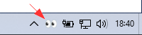
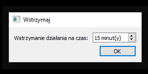
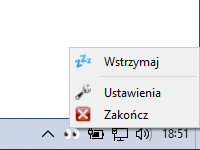
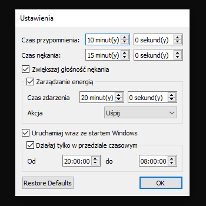

# AwakeGuardian

[English](README.md), [Polski](README.pl.md)

## O programie
**AwakeGuardian** to program który pomoże Ci utrzymać świadomość i nie zasnąć przed komputerem.
Program często poinformuje Cię kiedy wykryje brak Twojej aktywności przypominając, a później nękając Cię dźwiękowo.
Został on zaprojektowany by zużywać najmniej pamięci jak się tylko da, więc wymagało to kilku kompromisów.

## Instalacja
```pip install awake-guardian```

## Wymagania
**AwakeGuardian** wymaga wersji Python 3.6 lub nowszej.
Polega na różnych paczkach oprogramowania w zależności od używanego systemu.
Wszystkie wymgania powinny zostać zainstalowane automatycznie.

## Platformy
**AwakeGuardian** działa na Linuksie i Windowsie, i stara się funkcjonować tak samo na każdym z nich.
Ze względu na niektóre techniczne różnice pomiędzy systemami jest tylko kilka różnych podejść odnośnie niektórych aspektów, jak na przykład to jak uruchomić program.

### Linux
Na Linuksie to po prostu skrypt bez rozszerzenia pliku, który może być po prostu uruchomiony jako polecenie. 
Po prostu napisz polecenie: `AwakeGuardian`

### Windows
Na Windowsie pliki (skrypty Pythona) bez rozszerzania są dość skomplikowane do uruchomienia, więc żeby tego uniknąć jest po prostu skrypt bat, który uruchamia program bez okna konsoli.
Ponadto zaraz po instalacji na Windowsie ten sam plik bat jest umieszczany na Twoim pulpicie, żeby ułatwić uruchomienie programu za pierwszym razem lub uruchomienie razem z systemem Windows.
Jednakże możesz też uruchomić program w dowolnym momencie bez używania skryptu bat pisząc `AwakeGuardian.py` w *cmd* lub *PowerShellu*, ale w takim przypadku dostaniesz także okno konsoli Pythona które uruchamia program, więc zamykając to okno zamkniesz cały program.

## Używanie

### Ikona tacki systemowej
**AwakeGuardian** działa w tle i nie posiada żadnego głównego okna, jest tylko widoczny jako ikona w obszarze powiadomień lub tacce systemowej.



**AwakeGuardian** wyświetla ikony w zależności od aktualnego stanu programu.

-  oczekiwanie na określone okno czasowe w którym program może działać

-  aktywność jest wykrywana, żaden minutnik nie został przekroczony, kliknij tę ikonę żeby zatrzymać działanie programu

-  wykryto krótką nieaktywność, minutnik przypominania został przekroczony, odtwarzany jest dźwięk przypominania w pętli aż do wykrycia aktywności 

-  wykryto dłuższą nieaktywność, minutnik nękania został przekroczony, odtwarzany jest dźwięk nękania w pętli, który staje się co raz głośniejszy aż do wykrycia aktywności, później poziom dźwięku zostaje przywrócony do poprzedniego stanu

-  program jest wstrzymany, kliknij tę ikonę by wznowić działanie

### Wstrzymaj/Wznów
Kiedy klikniesz lewym przyciskiem myszy na ikonie **AwakeGuardian**, zobaczysz okno wstrzymania działania.



Po zamknięciu tego okna, menu w tacce systemowe zmieni się przykładowo na:



### Ustawienia
**AwakeGuardian** może zostać skonfigurowany w oknie ustawień. 
Możesz dostosować minutniki przypominania i nękania, włączać/wyłączać zwiększanie poziomu głośności w trakcie nękania oraz włączać/wyłączać uruchamiania programu ze startem systemu.
Można także określić okno czasowe w którym program może działać.


