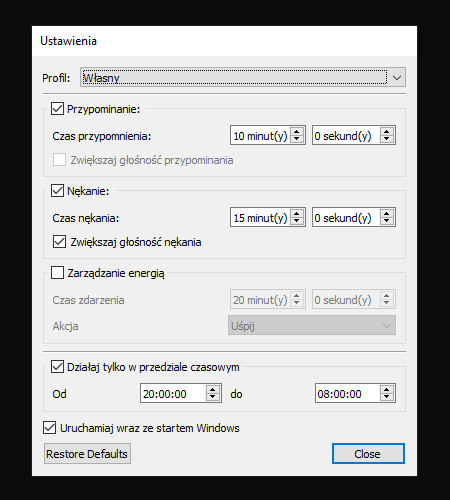

# AwakeGuardian

[English](README.md), [Polski](README.pl.md)

## O programie
**AwakeGuardian** to program który pomoże Ci utrzymać świadomość i nie zasnąć przed komputerem.
Program często poinformuje Cię kiedy wykryje brak Twojej aktywności przypominając, a później nękając Cię dźwiękowo.
Ponadto aby zaoszczędzić pieniądze, komputer można uśpić lub wyłączyć.
Został on zaprojektowany by zużywać najmniej pamięci jak się tylko da, więc wymagało to kilku kompromisów.

## Instalacja
```pip install awake-guardian```

## Wymagania
**AwakeGuardian** wymaga wersji Python 3.6 lub nowszej.
Polega na różnych paczkach oprogramowania w zależności od używanego systemu.
Wszystkie wymgania powinny zostać zainstalowane automatycznie.

## Platformy
Program działa na Linuksie i Windowsie, i stara się funkcjonować tak samo na każdym z nich.
Ze względu na niektóre techniczne różnice pomiędzy systemami zmienia się podejście odnośnie niektórych aspektów funkcjonowania programu.

**AwakeGuardian** to po prostu skrypt bez rozszerzenia pliku, który może być po prostu uruchomiony jako polecenie: `AwakeGuardian`

### Linux
W Linuksie polecenie to może być wpisane w dowolnym miejscu akceptującym komendy wiersza poleceń.

### Windows
W Windowsie możesz uruchomić program w *cmd*, *PowerShellu* lub używając okna dialogowego Uruchamianie (kombinacja klawiszy *Logo+R*), jednakże zmienna środowiskowa *PATH* musi być poprawnie skonfigurowana, co można wykonać podczas instalacji Pythona, gdy zaznaczona zostanie opcja *Add Python to PATH*.

## Używanie

### Ikona tacki systemowej
**AwakeGuardian** działa w tle i nie posiada żadnego głównego okna, jest tylko widoczny jako ikona w obszarze powiadomień lub tacce systemowej.


**AwakeGuardian** wyświetla ikony w zależności od aktualnego stanu programu.

-  oczekiwanie na określone okno czasowe w którym program może działać

-  aktywność jest wykrywana, żaden minutnik nie został przekroczony, kliknij tę ikonę żeby zatrzymać działanie programu

-  wykryto krótką nieaktywność, minutnik przypominania został przekroczony, odtwarzany jest dźwięk przypominania w pętli aż do wykrycia aktywności 

-  wykryto dłuższą nieaktywność, minutnik nękania został przekroczony, odtwarzany jest dźwięk nękania w pętli, który staje się co raz głośniejszy aż do wykrycia aktywności, później poziom dźwięku zostaje przywrócony do poprzedniego stanu

-  program jest wstrzymany, kliknij tę ikonę by wznowić działanie

### Wstrzymaj/Wznów
Kiedy klikniesz lewym przyciskiem myszy na ikonie **AwakeGuardian**, zobaczysz okno wstrzymania działania.


Po zamknięciu tego okna, menu w tacce systemowe zmieni się przykładowo na:


### Ustawienia
**AwakeGuardian** może zostać skonfigurowany w oknie ustawień. 
Możesz dostosować minutniki przypominania i nękania, włączać/wyłączać zwiększanie poziomu głośności w trakcie nękania oraz włączać/wyłączać uruchamiania programu ze startem systemu.
Można także określić okno czasowe w którym program może działać.

W sekcji zarządzania energią możesz określić czas po jakim zostanie wykonana akcja związana z oszczędzaniem energii.
W zależności od możliwości systemu operacyjnego dostępne opcje to:
- `Wyłącz` powoduje wyłączenie komputera po zadanym czasie nieaktywności.
- `Uśpij` powoduje przejście komputera w stan niskiego poboru energii z możliwością szybkiego wznowienia pracy.
- `Hibernuj` powoduje przejście komputera w stan głębokiego uśpienia (hibernacji) co maksymalnie ogranicza pobór energii, zrzut pamięci zwykle zapisywany jest na dysku twardym, przez co wznowienie pracy jest wolniejsze niż w stanie uśpienia, jednakże tryb ten nie zawsze jest obsługiwany.
- `Uśpienie hybrydowe` jest połączeniem uśpienia i hibernacji, w którym Twoje programy i otwarte pliki rezydują w pamięci operacyjnej jak przy uśpieniu, a następnie stan pamięci zostaje zrzucony na dysk twardy jak przy hibernacji, dzięki czemu możesz szybko wznowić pracę, a w razie utraty zasilania system zostanie wznowiony jak przy hibernacji.
- `Uśpij i zahibernuj` powoduje uśpienie komputera, a gdy przekroczony zostanie limit czasu lub pozostałej energii w baterii, wtedy komputer zostanie zahibernowany, co w przeciwieństwie do uśpienia hybrydowego nie spowoduje ewentualnego całkowitego wyczerpania baterii w stanie uśpienia.


